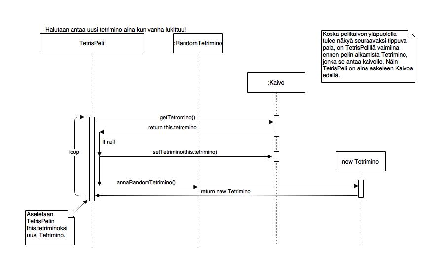
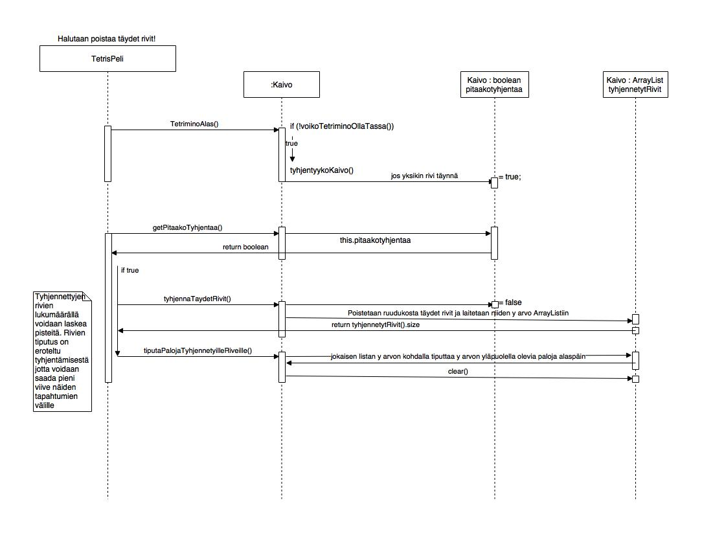

Aihe: Tetris peli, sisältää mahdollisesti useampia pelimoodeja ja highscore
listan. Muuten normaali tetris, ei käytä The Tetris Companyn uusimpia
sääntölisäyksiä kuten vaihtopalikkaa, mutta jos aikaa on sen voi lisätä
pelimoodiksi. Haluan tehdä päämoodista Tetris Grand Master ykkösen kaltaisen.

[Tärkeä aiheeseen liittyvä linkki](http://kitaru.1101b.com/TGMGUIDE/)

**Palikan kääntäminen**
TGM:n kaltaisen ja normi tetriksestä eriävän pelistä tekee sen oma palikan 
kääntö systeemi, jossa palat aloittavat aina "väärinpäin". 
Palikalla on aina pala alimmassa mahdollisessa
kohdassaan, esimerkiksi T:n eri kääntymiset ovat omituisia:

|   1          |   2       |      3    |      4    |
|:------------:|:----------:|:---------:|:---------:|
| [..][..][..] | [..][T][..]| [..][..][..] | [..][T][..] |
| [T][T][T]    | [..][T][T] | [..][T][..] | [T][T][..] |
| [..][T][..]  | [..][T][..]| [T][T][T] | [..][T][..] |

Koska T menee kolmannessa vaiheessa "istumaan", ei voida vain laittaa
muita kuin keskikohdan palaa pyörimään keskikohdan ympärillä. Pala voi
olla aloituskohdastaan vain yhden palan korkeammalla, ja koska voi nousta 
"katon" yläpuolelle, on pelikentän oikea korkeus korkeus + katto.
Myös I noudattaa näitä sääntöjä:

|    1           |	   2     |
|:--------------:|:-------------:|
|[..][..][..][..]|[..][..][T][..]|
|[T][T][T][T]    |[..][..][T][..]|
|[..][..][..][..]|[..][..][T][..]|
|[..][..][..][..]|[..][..][T][..]|

Paloilla T, J, ja L on neljä eri asentoa, paloilla Z, S, I kaksi ja O ei
voi kääntyä.

**Pistelaskenta**
PISTELASKU LUOKKAA EI EHDITTY SAAMAAN VALMIIKSI
Nyt peli laskee vain rikottuja rivejä ja kertaa ne kahdella. Jos rikottuja
rivejä on yli 3, annetaan kahden pisteen bonus.
Miten tulevaisuudessa:
Pistelaskentaan liittyy pisteiden lisäksi arvosana joka alkaa 9:stä
ja tippuu 1:teen, sen jälkeen on S1 ja nousee S9:ään asti.
Sen jälkeen on mahdollista saada paras arvosana GM eli Grand Master
jos onnistuu voittamaan pelin tietyssä aikarajassa.

[Lisää pistelaskusta](https://tetris.wiki/Tetris_The_Grand_Master#Scoring)

**Level ja painovoima**
Yksi pala on aina yksi taso. Painovoima (monta palaa Tetrimino
tippuu per ruutu) nousee yleensä 100:n tason välein mutta esimerkiksi
tasolla 200 se palaa helpoimpaan painovoimaan ja aloittaa kasvamisen
uudestaan. Max taso on 999. Huomioitavaa vielä on että päästäkseen seuraavaan sata lukuun
on aina rikottava yksi rivi. Level ja painovoima toimivat juuri niin kuin ne toimivat Tetris Grand Masterissa.

**Randomointi**
Vielä yksi lisäys on pelin tetrominon annon randomointi, peli muistaa aina
palan jonka se viimeksi antoi ja vähentää mahdollisuutta antaa se uudestaan.
Esimerkiksi vanhassa NES:n Tetriksessä pala oli aina täysin satunnainen.
Tarkempi kuvaus: Peli pitää listaa neljästä edellisestä palasesta, ja aloittaa
historialla jossa on neljä Z palaa. Pelin alussa peli ei suostu antamaan S, Z tai O palaa.
Kun peli randomoi tetris-palan, se katsoo historiaa. Jos historiassa on samanlainen pala, 
se yrittää uudelleen. Jos neljännellä kerralla Pala vieläkin löytyy historiasta,
 se silti antaa sen pelille. TTetris noudattaa näitä sääntöjä.

[Lähde](http://tetris.wikia.com/wiki/TGM_randomizer)

Tässä tämän hetken luokkakaavio:

**Rakennekuvaus**
 Pelin mainissa peli aloittaa käynnistämällä Käyttöliittymän.
Käyttöliittymä luo napin jota painamalla PelinAloittaja luokka luo JFramen
komponentit uudestaan Tetris-pelin piirtämistä varten. Käyttöliittymä 
jää taustalle odottamaan pelin päättymistä, jolloin se luo pelin "main menun" 
uudestaan.  PelinAloittaja antaa Tetrispeli luokalle kaikki tarvittavat luokat
pelin pyörittämistä varten ja Tetrispeli on vastuussa tästä lähtien pelin kulusta.
Tetrispelillä luo luokat Painovoima, Levellaskuri ja Pelilaskuri jotka laskevat
pelilogiikkaa. Tetrispelillä on myös RandomTetrimino luokka joka arpoo
Tetrispelin käyttämiä palasia. Tetrispelin Kaivo luokka hallinnoi pelikenttää
ja siinä olevia palasia. Tetrispeli antaa Kaivolle tarvittaessa uusia palasia.
Tetrispeli myös käskee Piirtajaa piirtämään pelikenttää tarvittaessa, noin
60 kertaa sekunnissa. Tetrispeli on ActionListener joka pyörii ajastetusti.
Myös nappainkuuntelijalla on pääsy Kaivo luokkaan, sitä tarvitaan Tetriminon
liikuttamisen tarkastuksissa.

**Checklist asioista jotka jäävät kurssin ulkopuolelle**
AKA Muistilista itselle
Tärkeitä:

Haamupala - pelissä on levelille 200 asti haalea pala joka näyttää mihin
ja missä asennossa pala tippuu alas jos pitää alas nappia pohjassa/odottaa
tarpeeksi. Periaatteessa tarpeeton, mutta ei kovin vaikea toteuttaa.

Pistelasku - TGM:n pistelasku on monimutkainen, mutta toteutettavissa. Pistelasku
luokka joutuu valitettavasti jäämään omalle ajalle. Myös arvosana (S1 yms) olisi
ollut kiva näkyä.

Tiukemmat kontrollit - KeyListenerin kanssa pähkäily vei paljon aikaa ilman ratkaisua.
Komentojen heittäminen listalle ja niiden suorittaminen peliloopissa niin, etteivät
tetrispalat liiku liian nopeasti on tosin mahdollista. Ja että palaa voi liikuttaa
samaan aikaan vaakasuunnassa ja pyörittää voisi olla kiva.

Palankääntö ennenkuin kaivossa - TGM:ssä voi kääntää palan ennen kuin se tippuu
kaivoon jos painaa kääntönappia juuri oikealla hetkellä.

Highscore lista - On kivempi pelata kun vaikka kilpailee itseään vastaan eikä
tarvitse kirjoittaa tuloksia paperille.

Pelin läpäisy - Pelin läpäisy on niin haastava tehtävä että en usko kenenkään
koskaan pääsevän tätä kyseistä versiota pelistä läpi, mutta olisihan se kivaa
jos se edes olisi mahdollista.

Vähemmän tärkeitä:

Kello - Pelissä kuuluisi olla alla kello mittaamassa aikaa. Pelin läpäisy 
vaatii tasolle 999 pääsyä tietyssä ajassa tietyillä pisteillä.

Game Over - Peli voisi ilmoittaa pelin päättymisestä tekstillä ja kertoa tuliko 
High Score

Taustoja - Peliin voisi heittää vaikka metsäkuvia taustoiksi. Kuvan tulisi vaihtua 
100 levelin välein.

Kontrollit voi vaihtaa - Main menussa tulisi olla pelin aloituksen ja highscore listan
lisäksi tapa voida vaihtaa pelinappeja. 

Sekvenssikaavioita:

Käskettävän tetriminon vaihtaminen kaivossa.

Kaivon tyhjentäminen kun jokin rivi(t) on täynnä.

