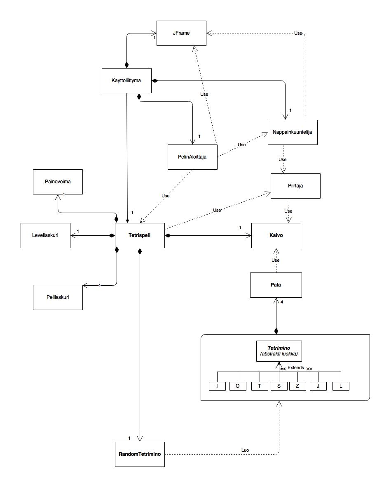

Aihe: Tetris peli, sisältää mahdollisesti useampia pelimoodeja ja highscore
listan. Muuten normaali tetris, ei käytä The Tetris Companyn uusimpia
sääntölisäyksiä kuten vaihtopalikkaa, mutta jos aikaa on sen voi lisätä
pelimoodiksi. Haluan tehdä päämoodista Tetris Grand Master ykkösen kaltaisen.

[Tärkeä aiheeseen liittyvä linkki](http://kitaru.1101b.com/TGMGUIDE/)

**Palikan kääntäminen**
TGM:n kaltaisen ja normi tetriksestä eriävän pelistä tekee sen oma palikan 
kääntö systeemi, jossa palat aloittavat aina "väärinpäin". 
Palikalla on aina pala alimmassa mahdollisessa
kohdassaan, esimerkiksi T:n eri kääntymiset ovat omituisia:

|   1       |   2       |      3    |      4    |
|:---------:|:---------:|:---------:|:---------:|
| [.][.][.] | [.][T][.] | [.][.][.] | [.][T][.] |
| [T][T][T] | [.][T][T] | [.][T][.] | [T][T][.] |
| [.][T][.] | [.][T][.] | [T][T][T] | [.][T][.] |

Koska T menee kolmannessa vaiheessa "istumaan", ei voida vain laittaa
muita kuin keskikohdan palaa pyörimään keskikohdan ympärillä. Pala voi
olla aloituskohdastaan vain yhden palan korkeammalla, ja koska voi nousta 
"katon" yläpuolelle, on pelikentän oikea korkeus korkeus + katto.
Myös I noudattaa näitä sääntöjä:

1:		2:
[ ][ ][ ][ ]	[ ][ ][T][ ]
[T][T][T][T]	[ ][ ][T][ ]
[ ][ ][ ][ ]	[ ][ ][T][ ]
[ ][ ][ ][ ]	[ ][ ][T][ ]

Paloilla T, J, ja L on neljä eri asentoa, paloilla Z, S, I kaksi ja O ei
voi kääntyä.

**Pistelaskenta**
Pistelaskentaan liittyy pisteiden lisäksi arvosana joka alkaa 9:stä
ja tippuu 1:teen, sen jälkeen on S1 ja nousee S9:ään asti.
Sen jälkeen on mahdollista saada paras arvosana GM eli Grand Master
jos onnistuu voittamaan pelin tietyssä aikarajassa.

[Lisää pistelaskusta](https://tetris.wiki/Tetris_The_Grand_Master#Scoring)

**Level ja painovoima**
Yksi pala on aina yksi taso. Painovoima (monta palaa Tetrimino
tippuu per ruutu) nousee yleensä 100:n tason välein mutta esimerkiksi
tasolla 200 se palaa helpoimpaan painovoimaan ja aloittaa kasvamisen
uudestaan, mutta tästä lisää kun se on ohjelmoinnin kannalta
relevantimpaa. Huomioitavaa vielä on että päästäkseen seuraavaan sata lukuun
on aina rikottava yksi rivi.

**Randomointi**
Vielä yksi lisäys on pelin tetrominon annon randomointi, peli muistaa aina
palan jonka se viimeksi antoi ja vähentää mahdollisuutta antaa se uudestaan.
Esimerkiksi vanhassa NES:n Tetriksessä pala oli aina täysin satunnainen.
Tästäkin taas lisää myöhemmin.

Tässä tämän hetken luokkakaavio:

Kuvassa on laitettu abstrakti luokka Tetrimino ja sen perilliset eli kaikki
eri tetrispalikat laatikkoon jotta ei tarvitsisi tehdä miljoonaa viivaa.
Tetriminon perilliset perivät Tetriminolta listan Paloista, en ole varma
täytyisikö silloinkin perillisistäkin piirtää viiva Palaan.
